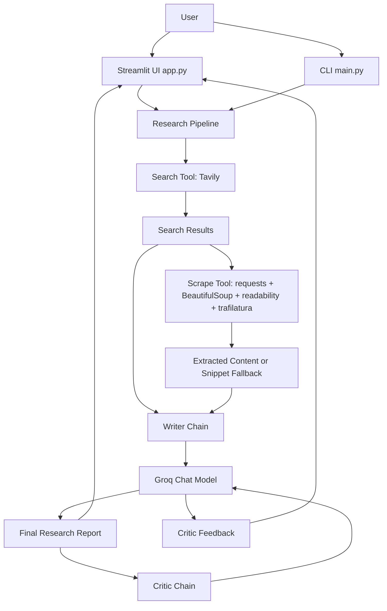

# LangChain Multi-Agent Research Assistant

An AI research assistant that searches the web, extracts source content, writes a structured report, and critiques the final output. The project uses LangChain, Groq-hosted LLMs, Tavily search, and a Streamlit UI.

## Features

- Web research with Tavily search
- URL scraping with multiple extraction strategies
- Groq-powered report writing and critique chains
- Streamlit web app for interactive research
- CLI entry point for quick local runs
- Fallback behavior for blocked or failed scraping attempts
- Retry handling for Groq rate limits

## Architecture



## Project Structure

```text
.
├── app.py                  # Streamlit web UI
├── main.py                 # CLI entry point
├── requirements.txt        # Python dependencies
├── src
│   ├── agents
│   │   └── agents.py       # Groq LLM, writer chain, critic chain
│   ├── pipeline
│   │   └── pipeline.py     # Research pipeline orchestration
│   └── tools
│       └── tools.py        # Tavily search and URL scraping tools
└── README.md
```

## Requirements

- Python 3.12 recommended
- Groq API key
- Tavily API key

Create a `.env` file in the project root:

```bash
GROQ_API_KEY=your_groq_api_key
TAVILY_API_KEY=your_tavily_api_key

# Optional. Defaults to openai/gpt-oss-20b.
GROQ_MODEL=openai/gpt-oss-20b
```

Do not commit `.env` or API keys.

## Installation

```bash
conda create -n langagent python=3.12 -y
conda activate langagent
pip install -r requirements.txt
```

## Run the Streamlit App

```bash
streamlit run app.py
```

If you are using the local conda environment directly:

```bash
/Users/raghavendrayelmati/miniconda3/envs/langagent/bin/streamlit run app.py
```

Then open:

```text
http://localhost:8501
```

## Run from CLI

```bash
python main.py
```

The CLI uses the topic configured in `main.py` and prints pipeline progress, the final report, and critic feedback.

## How It Works

1. Search: Tavily returns recent, relevant web results.
2. Read: the pipeline attempts to scrape result URLs and skips blocked pages.
3. Write: Groq generates a structured research report from snippets and scraped content.
4. Critique: Groq reviews the report and provides a score, strengths, improvement areas, and verdict.

## Configuration

The default Groq model is:

```text
openai/gpt-oss-20b
```

You can override it with:

```bash
GROQ_MODEL=your_available_groq_model
```

If a model returns `model_not_found`, list the models available to your Groq account and choose one your key can access.

## Notes

- Some websites block scraping and return `403`. The pipeline handles this by trying the next search result.
- Search snippets are used as a fallback if no URL can be scraped successfully.
- Groq rate limits are retried with short backoff delays.

## License

Add a license before publishing as an open-source project. MIT is a common choice for small research/demo tools.
